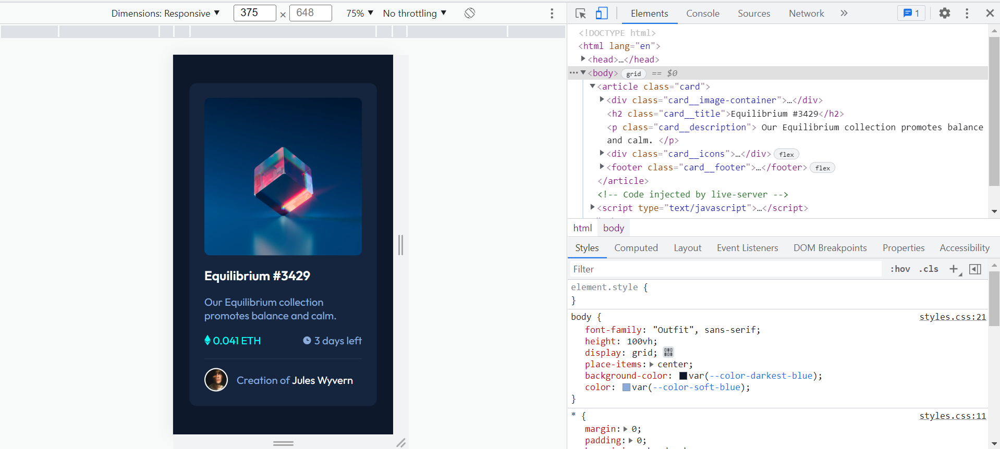
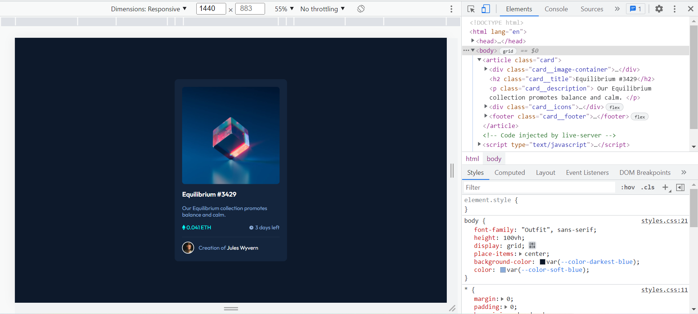

# Frontend Mentor - NFT preview card component solution

This is a solution to the [NFT preview card component challenge on Frontend Mentor](https://www.frontendmentor.io/challenges/nft-preview-card-component-SbdUL_w0U). Frontend Mentor challenges help you improve your coding skills by building realistic projects.

**NOTE: I did not have access to the Figma sketch so the design is not pixel perfect.**

## Table of contents

- [Overview](#overview)
  - [Screenshots](#screenshots)
- [My process](#my-process)
  - [Links](#links)
  - [Built with](#built-with)
  - [What I learned](#what-i-learned)
  - [Continued development](#continued-development)
- [Author](#author)

## Overview

### Screenshots

## My process

### Links

- Live Site URL: [Solution Hosted using GitHub Pages](https://marvin-figueroa.github.io/nft-preview-card-component/)

### Built with

- Semantic HTML5 markup
- CSS custom properties
- CSS Grid
- CSS Flexbox

### What I learned

- I learned that it is not possible to use ::after or ::before pseudo elements with an img tag.
- I also learned that when an image is inside a div some extra space is added below the image causing the div to be higher than expected.

### Continued development

- BEM CSS Architecture
- Making Layouts without including unnecessary elements.
- Working with ::before and ::after pseudo elements on :hover pseudo class.

## Author

- Github - [Marvin-Figueroa](https://github.com/Marvin-Figueroa)
- Frontend Mentor - [@Marvin-Figueroa](https://www.frontendmentor.io/profile/Marvin-Figueroa)
